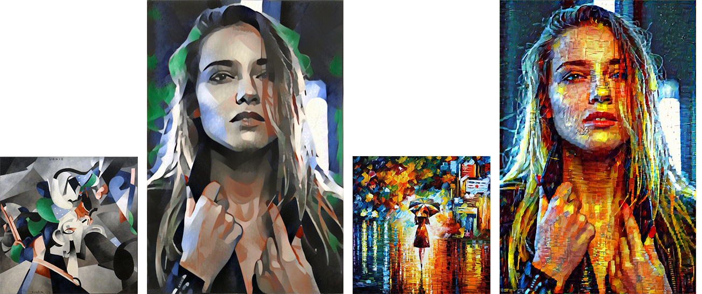
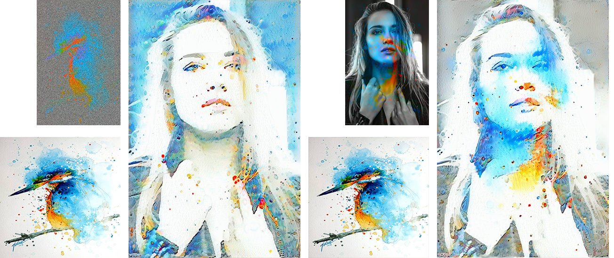
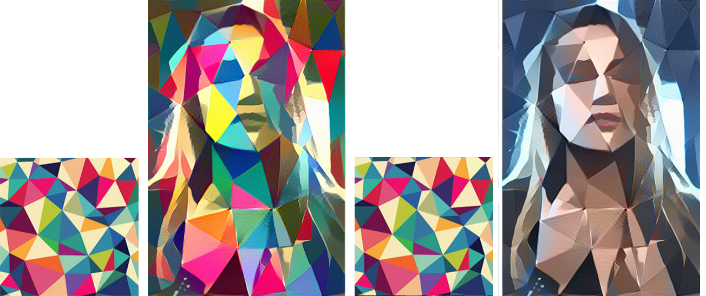
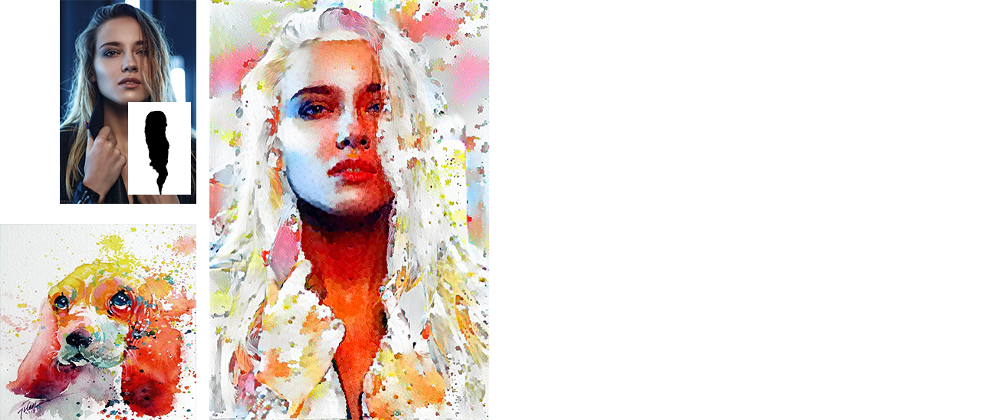

# Style transfer neural net
## Dependencies
* *cv2*
* *numpy*
* *skimage*
* *tensorflow*
* *jupyter notebook*
* [pre-trained VGG19 network:](https://github.com/machrisaa/tensorflow-vgg) I remove FC layers from VGG19 NPY, it decreased size of weights matrix from  561,203KB to 118,308KB, vgg19_fc_less.npy placed in this repository in rar file.

## ================================================
  This is my first implemantation of image style/content transfer, based on [A Neural Algorithm of Artistic Style](https://arxiv.org/abs/1508.06576) with few improvements suggested by [Improving the Neural Algorithm of Artistic Style](https://arxiv.org/abs/1605.04603) such as: 
* used shifted activations when computing Gram matrices. Works fine.
* Tried to use style layers weights in geometric progression, but it didn't make the result better. Instead i use weights which equalized all style layers loss and norm them to scalar. This solution notably affected image transformation, but in both ways. If the geometric structure of the style image needs to be preserved in transformation, last style layers weights need to be increased, otherwise just use the default weights.
### 
  Also added mask and colour preservation options.
## Examples

 In all examples below i'm using only one content image, style image placed in bottom left and initial transferred image in upper left from result

using random noise initialization of content/style transferred images with default style layers weights:

using random noise with lumina transfer from style image initialization in left and content image with flipped (lumina transfer from style_image) initialization in right:

  using default in left and colour preservation options in right:

  using random noise initialization of content/style transferred image with mask:

## Running
To use style-transfer just run transfer.ipynb in Jupyter notebook.
