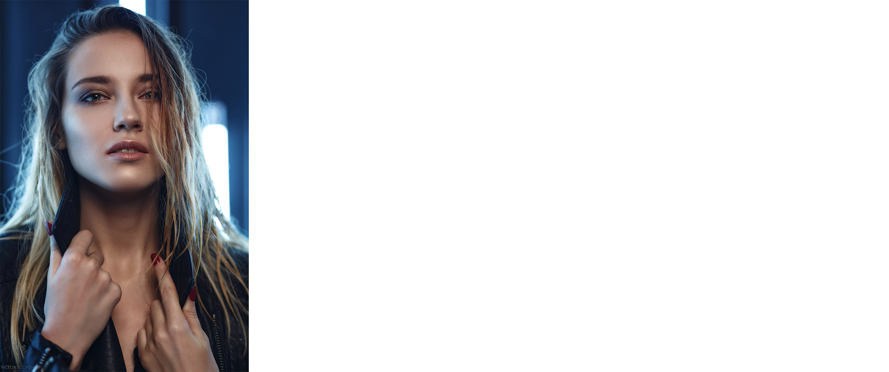

# Style transfer
## Dependencies
* *cv2*
* *numpy*
* *skimage*
* *tensorflow*
* *jupyter notebook*
* [pre-trained VGG19 network:](https://github.com/machrisaa/tensorflow-vgg) I remove FC layers from VGG19 NPY, it decreased size of weight matrix from  561,203KB to 118,308KB, vgg19_fc_less.npy placed in this repository in rar file.

## ================================================
  This is my first implemantation of image style/content transfer, based on [A Neural Algorithm of Artistic Style](https://arxiv.org/abs/1508.06576) with few improvements suggested by [Improving the Neural Algorithm of Artistic Style](https://arxiv.org/abs/1605.04603) such that: 
* used shifted activations when computing Gram matrices. Works fine.
* Tried to use style layers weights in geometric progression, but it didn't improve result. Instead i use weights which equalized all style layers loss and norm them to scalar. This solution notably affected image transformation, but in both ways. Depends if geometric
stracture of style image need to be preserved in transformation, last style layers weights need to be increased, else just use default weights.
### 
  Also added mask and colour preservation options.
## Examples

